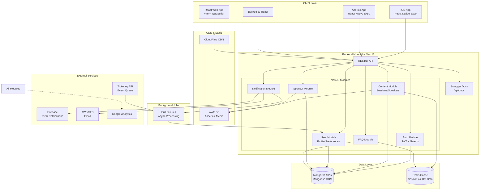
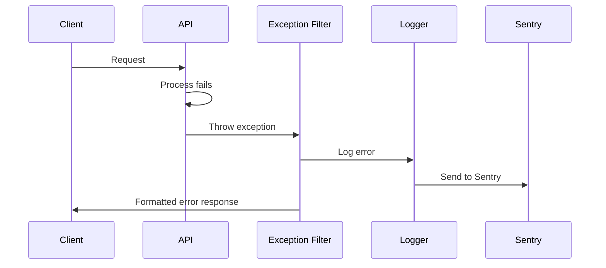

# VTEX DAY 26 Fullstack Architecture Document

## Introduction

This document outlines the complete fullstack architecture for **VTEX DAY 26**, including backend systems, frontend implementation, and their integration. It serves as the single source of truth for AI-driven development, ensuring consistency across the entire technology stack.

This unified approach combines what would traditionally be separate backend and frontend architecture documents, streamlining the development process for modern fullstack applications where these concerns are increasingly intertwined.

### Starter Template or Existing Project

**N/A - Greenfield project**

This is a custom-built platform designed specifically for the VTEX DAY 26 event, with no dependency on existing starter templates. The architecture will be designed from the ground up to meet the specific requirements of managing a large-scale corporate event with 20,000 participants.

### Change Log

| Date | Version | Description | Author |
|------|---------|-------------|--------|
| 26/09/2025 | 1.0 | Initial architecture document creation based on PRD v1.0 | Winston (Architect) |

## High Level Architecture

### Technical Summary

A plataforma VTEX DAY 26 será construída como uma **arquitetura monolítica modular** usando NestJS para o backend com MongoDB/Mongoose como banco de dados, React 18 com Vite para o frontend web, React Native com Expo para aplicativos móveis, e um backoffice administrativo em React. A comunicação entre frontend e backend ocorre através de APIs RESTful documentadas com Swagger, com capacidades real-time via WebSockets para funcionalidades ao vivo (Fase 2). A infraestrutura utiliza Docker containers deployados em AWS ECS ou Railway, MongoDB Atlas para database gerenciado, CloudFlare para CDN, e AWS S3 para armazenamento de arquivos, atendendo aos objetivos do PRD de suportar 20.000 usuários totais com picos de 2.000 simultâneos mantendo respostas de API abaixo de 200ms.

### Platform and Infrastructure Choice

**Platform:** Docker + Cloud (AWS ECS ou Railway)
**Key Services:** MongoDB Atlas, Redis (cache), AWS S3 (storage), CloudFlare CDN, Firebase (push notifications), AWS SES (email)
**Deployment Host and Regions:** São Paulo (sa-east-1) primário para baixa latência no Brasil

### Repository Structure

**Structure:** Monorepo com workspaces
**Monorepo Tool:** npm/yarn workspaces para gerenciar backend, web e mobile
**Package Organization:** Separado por aplicação (backend, web, mobile, backoffice, shared)

### High Level Architecture Diagram



### Architectural Patterns

- **Monolítica Modular:** Aplicação NestJS única com módulos bem definidos - _Rationale:_ Acelera desenvolvimento inicial, permite futura migração para microserviços se necessário
- **Repository Pattern com Mongoose:** Abstração de acesso a dados - _Rationale:_ Flexibilidade para mudanças de schema durante desenvolvimento rápido
- **DTO Pattern:** Class-validator para validação de entrada - _Rationale:_ Validação consistente e type-safe entre camadas
- **Guard Pattern (NestJS):** JWT auth guard global com roles - _Rationale:_ Segurança centralizada e declarativa
- **Component-Based UI:** Componentes React reutilizáveis - _Rationale:_ Máximo reuso entre web e mobile via React Native
- **White-Label First:** Design neutro inicial para rápida iteração - _Rationale:_ Permite desenvolvimento paralelo enquanto design finaliza no Lovable
- **Cache-Aside Pattern:** Redis para queries frequentes - _Rationale:_ Atender requisito de resposta < 200ms para 2.000 usuários simultâneos
- **Event Queue Pattern:** Bull queues para processamento assíncrono - _Rationale:_ Integração resiliente com ticketeira via fila de eventos
- **Offline-First Mobile:** Cache local com sincronização - _Rationale:_ Conectividade problemática em eventos lotados

## Tech Stack

### Technology Stack Table

| Category | Technology | Version | Purpose | Rationale |
|----------|-----------|---------|---------|-----------|
| Frontend Language | TypeScript | 5.0+ | Type-safe development across all frontends | Prevents runtime errors, improves maintainability with shared types |
| Frontend Framework | React | 18.2+ | Web application UI framework | Mature ecosystem, component reusability with React Native |
| UI Component Library | Tailwind CSS + shadcn/ui | 3.3+ / latest | Styling and pre-built components | Rapid development with utility-first CSS, customizable components |
| State Management | Zustand | 4.4+ | Client state management | Simpler than Redux, TypeScript support, works web and mobile |
| Backend Language | TypeScript | 5.0+ | Type-safe backend development | Consistency with frontend, prevents type errors |
| Backend Framework | NestJS | 10.0+ | Enterprise Node.js framework | Modular architecture, built-in DI, decorators, as specified in PRD |
| API Style | REST | - | HTTP-based API architecture | Simple, well-understood, easy to cache and document |
| Database | MongoDB | 6.0+ | NoSQL document database | Flexible schema for rapid iteration as specified in PRD |
| Cache | Redis | 7.0+ | In-memory data store | Session management, query caching for <200ms response times |
| File Storage | AWS S3 | - | Object storage service | Scalable media storage, CDN integration, cost-effective |
| Authentication | JWT + Passport | Latest | Token-based auth | Stateless, scalable, works across web/mobile |
| Frontend Testing | Jest + React Testing Library | 29+ / 14+ | Unit and integration testing | Standard React testing stack, good coverage tools |
| Backend Testing | Jest + Supertest | 29+ / 6+ | API and unit testing | NestJS native support, E2E testing capability |
| E2E Testing | Playwright | 1.40+ | Cross-browser testing | Modern, fast, supports mobile viewports |
| Build Tool | Vite | 5.0+ | Frontend build tool | Fast HMR, optimized builds, better DX than Webpack |
| Bundler | Vite (web) / Metro (mobile) | 5.0+ / 0.76+ | Asset bundling | Vite for web speed, Metro required for React Native |
| IaC Tool | Docker + Docker Compose | 24+ / 2.20+ | Containerization | Local dev parity, easy deployment to ECS/Railway |
| CI/CD | GitHub Actions | - | Automated deployment | Native GitHub integration, free for public repos |
| Monitoring | Winston + Sentry | 3.11+ / 7.0+ | Logging and error tracking | Structured logging, real-time error alerts |
| Logging | Winston | 3.11+ | Application logging | Flexible log levels, multiple transports |
| CSS Framework | Tailwind CSS | 3.3+ | Utility-first CSS | Rapid styling, consistent design system, small bundle |

## Data Models

### User

**Purpose:** Represents both admin users (backoffice) and event participants (app users)

**Key Attributes:**
- `_id`: ObjectId - MongoDB unique identifier
- `email`: string - Unique email for authentication
- `password`: string - Hashed password (bcrypt)
- `role`: enum - Role type (super_admin, producer, sponsor, participant)
- `profile`: object - User profile information
- `preferences`: object - User preferences and settings
- `ticketCode`: string - Ticket validation code (participants only)
- `isValidated`: boolean - Whether ticket has been validated
- `createdAt`: Date - Registration timestamp
- `updatedAt`: Date - Last modification timestamp

#### TypeScript Interface
```typescript
interface IUser {
  _id: Types.ObjectId;
  email: string;
  password: string;
  role: 'super_admin' | 'producer' | 'sponsor' | 'participant';
  profile: {
    name: string;
    phone?: string;
    company?: string;
    position?: string;
    photoUrl?: string;
    language: 'pt-BR' | 'en';
  };
  preferences?: {
    interests: string[];
    notificationsEnabled: boolean;
    favoriteSessionIds: Types.ObjectId[];
  };
  ticketCode?: string;
  isValidated: boolean;
  refreshToken?: string;
  lastLogin?: Date;
  createdAt: Date;
  updatedAt: Date;
}
```

**Relationships:**
- Has many FavoriteSessions (through preferences.favoriteSessionIds)
- Has many SocialPosts (author)
- Has many Messages (sender/receiver)

### Session

**Purpose:** Represents event sessions/talks with schedule and location information

**Key Attributes:**
- `_id`: ObjectId - MongoDB unique identifier
- `title`: object - Multilingual title (pt-BR, en)
- `description`: object - Multilingual description
- `speakerIds`: ObjectId[] - Array of speaker references
- `startTime`: Date - Session start time
- `endTime`: Date - Session end time
- `stage`: string - Physical location/stage
- `tags`: string[] - Categorization tags
- `sponsorIds`: ObjectId[] - Session sponsors
- `isHighlight`: boolean - Featured session flag
- `capacity`: number - Maximum attendees

#### TypeScript Interface
```typescript
interface ISession {
  _id: Types.ObjectId;
  title: {
    'pt-BR': string;
    'en': string;
  };
  description: {
    'pt-BR': string;
    'en': string;
  };
  speakerIds: Types.ObjectId[];
  startTime: Date;
  endTime: Date;
  stage: string;
  tags: string[];
  sponsorIds?: Types.ObjectId[];
  isHighlight: boolean;
  isVisible: boolean;
  capacity?: number;
  streamUrl?: string; // For phase 2 live streaming
  materials?: {
    title: string;
    url: string;
    type: 'pdf' | 'video' | 'link';
  }[];
  createdAt: Date;
  updatedAt: Date;
}
```

**Relationships:**
- Belongs to many Speakers (speakerIds)
- Belongs to many Sponsors (sponsorIds)
- Has many UserFavorites (through User.preferences)

### Speaker

**Purpose:** Information about event speakers/presenters

#### TypeScript Interface
```typescript
interface ISpeaker {
  _id: Types.ObjectId;
  name: string;
  bio: {
    'pt-BR': string;
    'en': string;
  };
  photoUrl: string;
  company: string;
  position: {
    'pt-BR': string;
    'en': string;
  };
  socialLinks?: {
    linkedin?: string;
    twitter?: string;
    github?: string;
    website?: string;
  };
  priority: number;
  isHighlight: boolean;
  isVisible: boolean;
  sessionIds: Types.ObjectId[]; // Computed from Sessions
  createdAt: Date;
  updatedAt: Date;
}
```

### Sponsor

**Purpose:** Event sponsors with different tiers and benefits

#### TypeScript Interface
```typescript
interface ISponsor {
  _id: Types.ObjectId;
  name: string;
  description: {
    'pt-BR': string;
    'en': string;
  };
  logoUrl: string;
  tier: string; // References SponsorTier
  orderInTier: number;
  websiteUrl: string;
  standLocation?: string;
  adminEmail: string;
  contactEmail?: string;
  socialLinks?: {
    linkedin?: string;
    instagram?: string;
    facebook?: string;
  };
  maxPosts: number;
  postsUsed: number;
  materials?: {
    title: string;
    url: string;
    type: 'pdf' | 'video' | 'link';
  }[];
  metrics?: {
    profileViews: number;
    messagesReceived: number;
    materialsDownloaded: number;
  };
  isVisible: boolean;
  createdAt: Date;
  updatedAt: Date;
}
```

## API Specification

### REST API Specification

The API follows RESTful principles with the following key endpoints:

#### Authentication
- `POST /auth/login` - User authentication
- `POST /auth/refresh` - Refresh access token
- `POST /auth/validate-ticket` - Validate event ticket

#### Sessions/Agenda
- `GET /sessions` - Get all sessions with filters
- `GET /sessions/:id` - Get session details
- `POST /sessions/:id/favorite` - Add to favorites (auth required)
- `DELETE /sessions/:id/favorite` - Remove from favorites (auth required)

#### Speakers
- `GET /speakers` - Get all speakers
- `GET /speakers/:id` - Get speaker details

#### Sponsors
- `GET /sponsors` - Get sponsors grouped by tier
- `GET /sponsors/:id` - Get sponsor details
- `POST /sponsors/:id/message` - Send message to sponsor (auth required)

#### FAQ
- `GET /faq/categories` - Get FAQ categories
- `GET /faq` - Get FAQs with optional filters

#### User Profile
- `GET /users/me` - Get current user profile (auth required)
- `PATCH /users/me` - Update profile (auth required)
- `GET /users/me/agenda` - Get favorited sessions (auth required)

#### Admin Endpoints
- Full CRUD operations for all entities
- Push notification management
- Content visibility control
- Analytics and reporting

## Components

### API Gateway / Load Balancer
**Responsibility:** Entry point for all HTTP requests, handles routing, rate limiting, CORS, and SSL termination

### NestJS Backend Application
**Responsibility:** Core business logic, API endpoints, data validation, and orchestration of all backend operations

### Authentication Service Module
**Responsibility:** User authentication, JWT token management, ticket validation, and session management

### Content Management Module
**Responsibility:** CRUD operations for sessions, speakers, sponsors, FAQ, and all event content

### Notification Service Module
**Responsibility:** Push notification scheduling and delivery, in-app notification management

### React Web Application
**Responsibility:** Public website interface, responsive design, SEO optimization

### React Native Mobile Apps
**Responsibility:** Native mobile experience for iOS and Android with offline capabilities

### Backoffice Admin Panel
**Responsibility:** Administrative interface for content management and event control

## Unified Project Structure

```
vtexday26/
├── .github/                    # CI/CD workflows
│   └── workflows/
│       ├── ci.yaml
│       └── deploy.yaml
├── apps/                       # Application packages
│   ├── web/                    # React web application
│   │   ├── src/
│   │   │   ├── components/     # UI components
│   │   │   ├── pages/          # Route pages
│   │   │   ├── hooks/          # Custom React hooks
│   │   │   ├── services/       # API client services
│   │   │   ├── stores/         # Zustand state management
│   │   │   ├── styles/         # Global styles/themes
│   │   │   └── utils/          # Utilities
│   │   ├── public/             # Static assets
│   │   ├── tests/              # Frontend tests
│   │   └── package.json
│   ├── mobile/                 # React Native app
│   │   ├── src/
│   │   │   ├── components/
│   │   │   ├── screens/
│   │   │   ├── navigation/
│   │   │   ├── services/
│   │   │   └── utils/
│   │   ├── assets/
│   │   └── package.json
│   ├── api/                    # NestJS backend
│   │   ├── src/
│   │   │   ├── modules/        # Feature modules
│   │   │   │   ├── auth/
│   │   │   │   ├── sessions/
│   │   │   │   ├── speakers/
│   │   │   │   ├── sponsors/
│   │   │   │   ├── users/
│   │   │   │   └── notifications/
│   │   │   ├── common/         # Shared utilities
│   │   │   │   ├── decorators/
│   │   │   │   ├── filters/
│   │   │   │   ├── guards/
│   │   │   │   └── interceptors/
│   │   │   └── main.ts
│   │   ├── tests/              # Backend tests
│   │   └── package.json
│   └── admin/                  # Backoffice React app
│       ├── src/
│       └── package.json
├── packages/                   # Shared packages
│   ├── shared/                 # Shared types/utilities
│   │   ├── src/
│   │   │   ├── types/          # TypeScript interfaces
│   │   │   ├── constants/      # Shared constants
│   │   │   └── utils/          # Shared utilities
│   │   └── package.json
│   └── ui/                     # Shared UI components
│       ├── src/
│       └── package.json
├── infrastructure/             # Docker and deployment configs
│   ├── docker/
│   │   ├── Dockerfile.api
│   │   ├── Dockerfile.web
│   │   └── docker-compose.yml
│   └── k8s/                    # Kubernetes manifests (if needed)
├── scripts/                    # Build and utility scripts
├── docs/                       # Documentation
│   ├── prd.md
│   └── architecture.md
├── .env.example                # Environment template
├── package.json                # Root package.json
├── tsconfig.json              # TypeScript config
└── README.md
```

## Development Workflow

### Local Development Setup

#### Prerequisites
```bash
# Required software
node >= 18.0.0
npm >= 9.0.0
docker >= 24.0.0
docker-compose >= 2.20.0
```

#### Initial Setup
```bash
# Clone repository
git clone https://github.com/vtex/vtexday26.git
cd vtexday26

# Install dependencies
npm install

# Copy environment variables
cp .env.example .env

# Start MongoDB and Redis locally
docker-compose up -d mongodb redis

# Run database migrations/seeds
npm run db:seed

# Start development servers
npm run dev
```

#### Development Commands
```bash
# Start all services
npm run dev

# Start frontend only
npm run dev:web

# Start backend only
npm run dev:api

# Start mobile
npm run dev:mobile

# Run tests
npm run test
npm run test:e2e

# Build for production
npm run build

# Lint and format
npm run lint
npm run format
```

### Environment Configuration

#### Required Environment Variables
```bash
# Frontend (.env.local)
VITE_API_URL=http://localhost:3000/v1
VITE_GA_ID=G-XXXXXXXXXX

# Backend (.env)
NODE_ENV=development
PORT=3000
MONGODB_URI=mongodb://localhost:27017/vtexday26
REDIS_URL=redis://localhost:6379
JWT_SECRET=your-secret-key
JWT_EXPIRES_IN=1d
REFRESH_TOKEN_EXPIRES_IN=7d
AWS_ACCESS_KEY_ID=your-key
AWS_SECRET_ACCESS_KEY=your-secret
AWS_S3_BUCKET=vtexday26-media
FIREBASE_PROJECT_ID=vtexday26
AWS_SES_REGION=sa-east-1
AWS_SES_FROM_EMAIL=noreply@vtexday.com.br

# Shared
API_VERSION=v1
LANGUAGE_DEFAULT=pt-BR
```

## Deployment Architecture

### Deployment Strategy

**Frontend Deployment:**
- **Platform:** CloudFlare Pages or Vercel
- **Build Command:** `npm run build:web`
- **Output Directory:** `apps/web/dist`
- **CDN/Edge:** CloudFlare global network

**Backend Deployment:**
- **Platform:** AWS ECS ou Railway
- **Build Command:** `npm run build:api`
- **Deployment Method:** Docker containers with auto-scaling

### CI/CD Pipeline
```yaml
name: Deploy

on:
  push:
    branches: [main, staging]

jobs:
  test:
    runs-on: ubuntu-latest
    steps:
      - uses: actions/checkout@v3
      - uses: actions/setup-node@v3
      - run: npm ci
      - run: npm test
      - run: npm run test:e2e

  deploy-api:
    needs: test
    runs-on: ubuntu-latest
    steps:
      - uses: actions/checkout@v3
      - name: Build Docker image
        run: docker build -f infrastructure/docker/Dockerfile.api -t vtexday26-api .
      - name: Push to Registry
        run: docker push ${{ secrets.REGISTRY }}/vtexday26-api
      - name: Deploy to ECS
        run: aws ecs update-service --cluster vtexday26 --service api

  deploy-web:
    needs: test
    runs-on: ubuntu-latest
    steps:
      - uses: actions/checkout@v3
      - run: npm ci
      - run: npm run build:web
      - name: Deploy to CloudFlare
        run: npx wrangler pages publish apps/web/dist
```

### Environments

| Environment | Frontend URL | Backend URL | Purpose |
|------------|--------------|-------------|---------|
| Development | http://localhost:5173 | http://localhost:3000 | Local development |
| Staging | https://staging.vtexday.com.br | https://api-staging.vtexday.com.br | Pre-production testing |
| Production | https://vtexday.com.br | https://api.vtexday.com.br | Live environment |

## Security and Performance

### Security Requirements

**Frontend Security:**
- CSP Headers: Default-src 'self'; script-src 'self' 'unsafe-inline'
- XSS Prevention: React automatic escaping, sanitize user inputs
- Secure Storage: Sensitive data in memory only, tokens in httpOnly cookies

**Backend Security:**
- Input Validation: class-validator on all DTOs
- Rate Limiting: 100 requests per minute per IP
- CORS Policy: Whitelist specific origins only

**Authentication Security:**
- Token Storage: HttpOnly cookies with Secure and SameSite flags
- Session Management: Redis with TTL, refresh token rotation
- Password Policy: Minimum 12 characters, complexity requirements

### Performance Optimization

**Frontend Performance:**
- Bundle Size Target: < 200KB initial JS
- Loading Strategy: Lazy loading for routes, code splitting
- Caching Strategy: Service worker for offline, browser cache for assets

**Backend Performance:**
- Response Time Target: p95 < 200ms
- Database Optimization: Indexes on all query fields, aggregation pipelines
- Caching Strategy: Redis for hot paths, 5-minute TTL for listings

## Testing Strategy

### Testing Pyramid

```
        E2E Tests (10%)
       /              \
    Integration (30%)
   /                  \
Unit Tests (60%)
```

### Test Organization

#### Frontend Tests
```
apps/web/tests/
├── unit/
│   ├── components/
│   ├── hooks/
│   └── utils/
├── integration/
│   └── services/
└── e2e/
    └── user-flows/
```

#### Backend Tests
```
apps/api/tests/
├── unit/
│   ├── services/
│   └── guards/
├── integration/
│   └── controllers/
└── e2e/
    └── api-flows/
```

### Test Examples

#### Frontend Component Test
```typescript
describe('SessionCard', () => {
  it('should display session information', () => {
    const session = mockSession();
    render(<SessionCard session={session} />);
    expect(screen.getByText(session.title['pt-BR'])).toBeInTheDocument();
  });
});
```

#### Backend API Test
```typescript
describe('SessionsController', () => {
  it('should return filtered sessions', async () => {
    const response = await request(app.getHttpServer())
      .get('/sessions?stage=main')
      .expect(200);

    expect(response.body.data).toHaveLength(5);
    expect(response.body.data[0].stage).toBe('main');
  });
});
```

## Coding Standards

### Critical Fullstack Rules

- **Type Sharing:** Always define types in packages/shared and import from there
- **API Calls:** Never make direct HTTP calls - use the service layer
- **Environment Variables:** Access only through config objects, never process.env directly
- **Error Handling:** All API routes must use the standard error handler
- **State Updates:** Never mutate state directly - use proper state management patterns
- **MongoDB Queries:** Always use indexes for queries, avoid full collection scans
- **Async Operations:** Use async/await consistently, handle all promise rejections
- **Security:** Never log sensitive data, sanitize all user inputs

### Naming Conventions

| Element | Frontend | Backend | Example |
|---------|----------|---------|---------|
| Components | PascalCase | - | `UserProfile.tsx` |
| Hooks | camelCase with 'use' | - | `useAuth.ts` |
| API Routes | - | kebab-case | `/api/user-profile` |
| Database Collections | - | PascalCase singular | `Session` |
| Database Fields | - | camelCase | `startTime` |
| Environment Variables | - | SCREAMING_SNAKE_CASE | `MONGODB_URI` |

## Error Handling Strategy

### Error Flow


### Error Response Format
```typescript
interface ApiError {
  error: {
    code: string;
    message: string;
    details?: Record<string, any>;
    timestamp: string;
    requestId: string;
  };
}
```

### Frontend Error Handling
```typescript
const errorHandler = (error: AxiosError<ApiError>) => {
  if (error.response) {
    // Server error
    showNotification({
      type: 'error',
      message: error.response.data.error.message
    });
  } else if (error.request) {
    // Network error
    showNotification({
      type: 'error',
      message: 'Network error. Please check your connection.'
    });
  }
};
```

### Backend Error Handling
```typescript
@Catch()
export class GlobalExceptionFilter implements ExceptionFilter {
  catch(exception: unknown, host: ArgumentsHost) {
    const ctx = host.switchToHttp();
    const response = ctx.getResponse<Response>();
    const request = ctx.getRequest<Request>();

    const status = exception instanceof HttpException
      ? exception.getStatus()
      : HttpStatus.INTERNAL_SERVER_ERROR;

    const errorResponse = {
      error: {
        code: exception instanceof HttpException
          ? exception.constructor.name
          : 'InternalServerError',
        message: exception instanceof HttpException
          ? exception.message
          : 'An unexpected error occurred',
        timestamp: new Date().toISOString(),
        requestId: request.id,
      }
    };

    this.logger.error('Request failed', exception);

    response.status(status).json(errorResponse);
  }
}
```

## Monitoring and Observability

### Monitoring Stack

- **Frontend Monitoring:** Sentry for error tracking, Google Analytics for user behavior
- **Backend Monitoring:** Winston for structured logging, Sentry for exceptions
- **Error Tracking:** Sentry with source maps for both frontend and backend
- **Performance Monitoring:** Custom metrics to CloudWatch, APM with DataDog (optional)

### Key Metrics

**Frontend Metrics:**
- Core Web Vitals (LCP, FID, CLS)
- JavaScript error rate
- API response times from client perspective
- User interaction events

**Backend Metrics:**
- Request rate per endpoint
- Error rate (4xx, 5xx)
- Response time percentiles (p50, p95, p99)
- Database query performance
- Cache hit ratio
- Queue processing times

## Checklist Results Report

_To be populated after running architect-checklist_