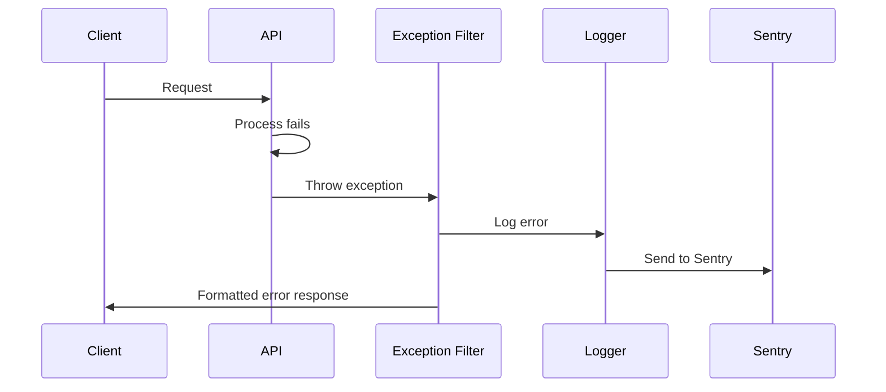

# Error Handling Strategy

## Error Flow


## Error Response Format
```typescript
interface ApiError {
  error: {
    code: string;
    message: string;
    details?: Record<string, any>;
    timestamp: string;
    requestId: string;
  };
}
```

## Frontend Error Handling
```typescript
const errorHandler = (error: AxiosError<ApiError>) => {
  if (error.response) {
    // Server error
    showNotification({
      type: 'error',
      message: error.response.data.error.message
    });
  } else if (error.request) {
    // Network error
    showNotification({
      type: 'error',
      message: 'Network error. Please check your connection.'
    });
  }
};
```

## Backend Error Handling
```typescript
@Catch()
export class GlobalExceptionFilter implements ExceptionFilter {
  catch(exception: unknown, host: ArgumentsHost) {
    const ctx = host.switchToHttp();
    const response = ctx.getResponse<Response>();
    const request = ctx.getRequest<Request>();

    const status = exception instanceof HttpException
      ? exception.getStatus()
      : HttpStatus.INTERNAL_SERVER_ERROR;

    const errorResponse = {
      error: {
        code: exception instanceof HttpException
          ? exception.constructor.name
          : 'InternalServerError',
        message: exception instanceof HttpException
          ? exception.message
          : 'An unexpected error occurred',
        timestamp: new Date().toISOString(),
        requestId: request.id,
      }
    };

    this.logger.error('Request failed', exception);

    response.status(status).json(errorResponse);
  }
}
```
