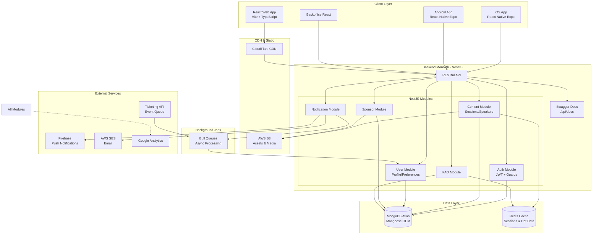

# High Level Architecture

## Technical Summary

A plataforma VTEX DAY 26 será construída como uma **arquitetura monolítica modular** usando NestJS para o backend com MongoDB/Mongoose como banco de dados, React 18 com Vite para o frontend web, React Native com Expo para aplicativos móveis, e um backoffice administrativo em React. A comunicação entre frontend e backend ocorre através de APIs RESTful documentadas com Swagger, com capacidades real-time via WebSockets para funcionalidades ao vivo (Fase 2). A infraestrutura utiliza Docker containers deployados em AWS ECS ou Railway, MongoDB Atlas para database gerenciado, CloudFlare para CDN, e AWS S3 para armazenamento de arquivos, atendendo aos objetivos do PRD de suportar 20.000 usuários totais com picos de 2.000 simultâneos mantendo respostas de API abaixo de 200ms.

## Platform and Infrastructure Choice

**Platform:** Docker + Cloud (AWS ECS ou Railway)
**Key Services:** MongoDB Atlas, Redis (cache), AWS S3 (storage), CloudFlare CDN, Firebase (push notifications), AWS SES (email)
**Deployment Host and Regions:** São Paulo (sa-east-1) primário para baixa latência no Brasil

## Repository Structure

**Structure:** Monorepo com workspaces
**Monorepo Tool:** npm/yarn workspaces para gerenciar backend, web e mobile
**Package Organization:** Separado por aplicação (backend, web, mobile, backoffice, shared)

## High Level Architecture Diagram

## Architectural Patterns

- **Monolítica Modular:** Aplicação NestJS única com módulos bem definidos - _Rationale:_ Acelera desenvolvimento inicial, permite futura migração para microserviços se necessário
- **Repository Pattern com Mongoose:** Abstração de acesso a dados - _Rationale:_ Flexibilidade para mudanças de schema durante desenvolvimento rápido
- **DTO Pattern:** Class-validator para validação de entrada - _Rationale:_ Validação consistente e type-safe entre camadas
- **Guard Pattern (NestJS):** JWT auth guard global com roles - _Rationale:_ Segurança centralizada e declarativa
- **Component-Based UI:** Componentes React reutilizáveis - _Rationale:_ Máximo reuso entre web e mobile via React Native
- **White-Label First:** Design neutro inicial para rápida iteração - _Rationale:_ Permite desenvolvimento paralelo enquanto design finaliza no Lovable
- **Cache-Aside Pattern:** Redis para queries frequentes - _Rationale:_ Atender requisito de resposta < 200ms para 2.000 usuários simultâneos
- **Event Queue Pattern:** Bull queues para processamento assíncrono - _Rationale:_ Integração resiliente com ticketeira via fila de eventos
- **Offline-First Mobile:** Cache local com sincronização - _Rationale:_ Conectividade problemática em eventos lotados
